<div align="center">

# ▶ Tweensy

**Make motion-graphics videos by chatting with Claude.**
Pick an example, press Send, and Claude Code builds and renders the video on your own computer in up to 4K at 60 fps.

[](https://github.com/TravisSaper/tweensy/actions/workflows/ci.yml)


[](LICENSE)

<picture>
  <source media="(prefers-color-scheme: dark)" srcset="docs/screenshots/main-dark.png">
  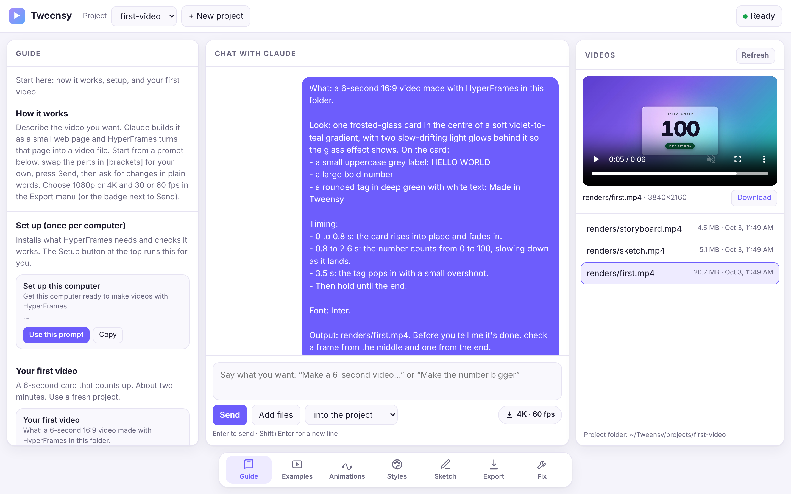
</picture>

</div>

---

Tweensy is a small local web app for making motion graphics without After Effects and without
writing code. Claude writes each animation as a web page and
[HyperFrames](https://github.com/heygen-com/hyperframes) renders it to video. You watch every step
as it happens, and the finished video plays right next to the chat.

<div align="center">
  <picture>
    <source srcset="docs/demo-render.avif" type="image/avif">
    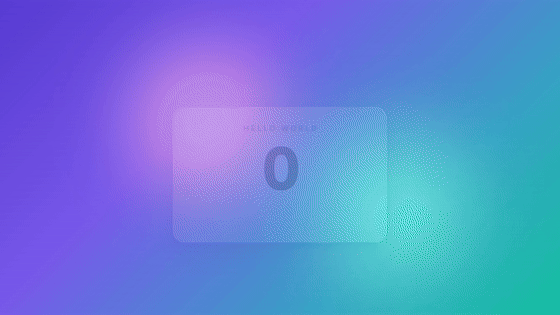
  </picture><br>
  <sub>"Your first video" example, sent once from Tweensy and rendered in 4K at 60 fps (3840×2160). No edits.</sub>
</div>

## Features

- 🧭 **Everything one tap away.** The bottom bar switches between **Guide**, **Examples**,
  **Animations**, **Styles**, **Sketch**, **Export** and **Fix**, while the chat and your videos stay on screen.
- ✨ **Examples that work first time.** First video, text-only, product launch, app promo from
  screenshots, and graphics on your own footage. Each is laid out as *What / Look / Timing / Output*,
  with **[brackets]** for the parts you swap.
- ✏️ **Storyboard.** Draw your video scene by scene: pen for layout, red arrows for motion, blue
  labels, plus an optional style & transition note per scene. Claude builds it, and asks first if a
  scene is unclear.
- 🎞️ **Animations as one-click chips.** Ten classic moves (rise, pop, count-up, typewriter, punch-in…)
  and quick changes (bouncier, calmer, bigger text, brand colours).
- 🎨 **Four styles to stack under any example.** Bold Type, Frosted Glass, Paper Print and Neon Pop.
- 🎚️ **Export picker.** Choose **1080p or 4K** and **30 or 60 fps** per project. Every render uses the
  highest quality setting. ProRes 4444, PNG frames, 24 fps and transparent overlays are one click away.
- 💬 **Talk in plain words.** "Make the number bigger." Each project keeps its own conversation.
- ⏱️ **Know when it's done.** A live card shows Planning → Building → Rendering → Checking with a
  timer, a real **progress bar with time left** while the video renders, and a green "Done in 2:15" when
  it's ready. The browser tab and a desktop notification tell you too, even if you switch away.
- 👀 **See what Claude is doing.** A live step list, replies that stream in, a **Stop** button, and
  Claude checks frames from every finished render before it says it's done.
- 🎬 **Videos panel** with a player, the real resolution, and a download button.
- 🧰 **First-run setup.** A checklist finds what's missing (Claude Code, sign-in, Node, FFmpeg) and
  gives the exact command for your computer, or installs it for you.
- 🪶 **One download, nothing else to install for the app.** A ready-to-run file for Windows, Mac and
  Linux (or run it from source with plain Python). Light and dark mode, and a phone-sized layout.

## Quick start

> **You need:** a paid Claude plan (Pro, Max, Team or Enterprise) and [Claude Code](https://code.claude.com/docs)
> signed in. The Setup screen walks you through anything that's missing.

1. **Download** the file for your computer from the latest [release](../../releases/latest):

   | Computer | Download | Open it | First time only |
   | --- | --- | --- | --- |
   | Windows | `Tweensy-windows-vX.Y.Z.exe` | double-click it | **More info** → **Run anyway** |
   | Mac (Apple Silicon) | `Tweensy-mac-vX.Y.Z.dmg` | open it, double-click **Tweensy** | right-click **Tweensy** → **Open** |
   | Linux | `Tweensy-linux-vX.Y.Z.tar.gz` | extract it, run `./tweensy` | — |

2. Your browser opens **http://localhost:8765**. Keep the small terminal window open while you work.
   Your projects are saved in a **Tweensy** folder in your home folder.
3. Click **Make my first video**, swap in your name, press **Send**, and wait a few minutes.

**From source** (any computer with Python 3.9+, including Intel Macs): clone the repo and double-click
`Start Tweensy.command` (Mac), `Start Tweensy.bat` (Windows) or `start.sh` (Linux), or run
`python3 app.py`. Projects are then saved in the repo's `projects` folder.

## Export quality

Pick it in the **Export** menu, or click the **4K · 60 fps** badge next to Send. Each project remembers
its own choice.

| Setting | Output (16:9) | Render time for a 6 s video* | Good for |
| --- | --- | --- | --- |
| 1080p · 30 fps | 1920×1080 | ~8 s | quick drafts, checking an idea |
| 1080p · 60 fps | 1920×1080 | ~10 s | smooth social posts |
| 4K · 30 fps | 3840×2160 | ~25 s | sharp, standard motion |
| **4K · 60 fps** (default) | 3840×2160 | ~45 s | the best quality there is |

<sub>*Measured on a 20-core laptop for the first-video example. Every setting renders with HyperFrames'
`high` preset at CRF 12. Vertical videos come out at 1080×1920 or 2160×3840.</sub>

## Storyboard it, Claude builds it

<p align="center">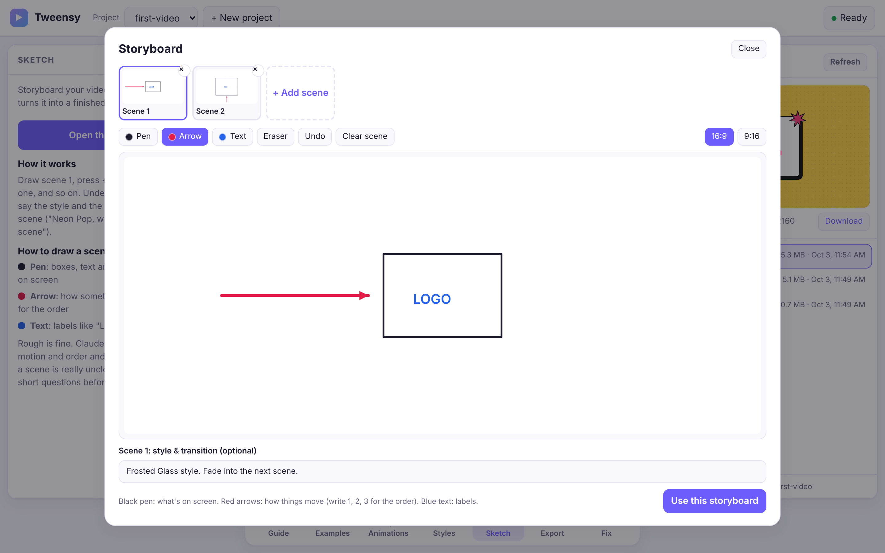</p>
<p align="center">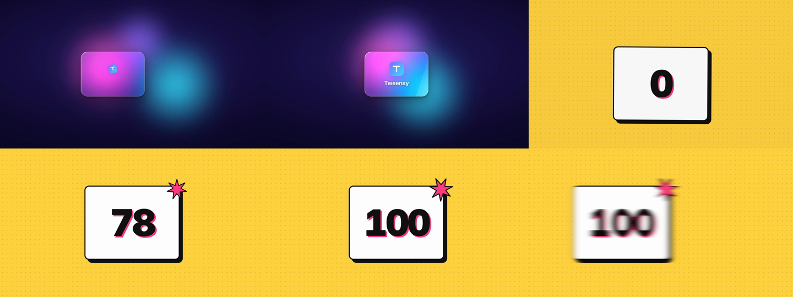</p>
<p align="center"><sub>Top: a two-scene storyboard with notes ("Frosted Glass, fade into the next scene" / "Neon Pop, counts to 100, whip-pan out").<br>Bottom: frames from the video Claude made from it, in one go.</sub></p>

Open **Sketch** in the bottom bar and draw scene 1 (16:9 or 9:16). Press **+ Add scene** for each next
scene. Under every scene there's an optional **style & transition** box ("Neon Pop, whip-pan into the
next scene"). Press **Use this storyboard**: each scene is saved to the project's `sketches/` folder and
a ready message lands in the chat box. Press Send.

Claude looks at every scene first. If one is genuinely unclear, it asks you a few short numbered
questions and waits, instead of guessing. Otherwise it tells you in one line per scene what it thinks
happens, then builds and renders the whole video.

## Knowing when it's done

<table>
  <tr>
    <td width="50%">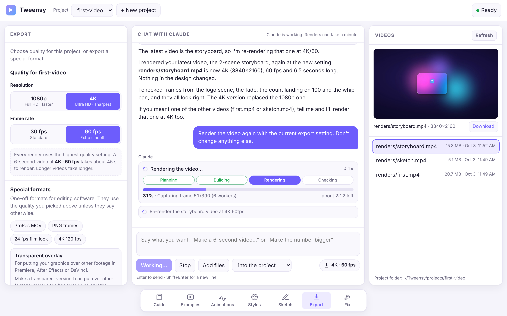</td>
    <td width="50%">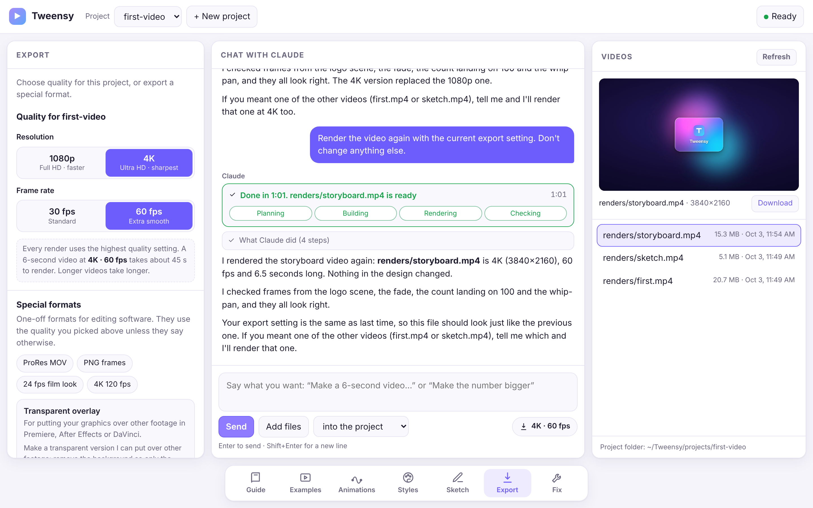</td>
  </tr>
  <tr>
    <td align="center"><b>Rendering.</b> Real progress from HyperFrames, with time left.</td>
    <td align="center"><b>Done.</b> The new video opens in the player by itself.</td>
  </tr>
</table>

If something stops Claude early, the card turns red and says why in plain words. For example, if your
Claude plan's usage limit is reached, it tells you when it resets and to say **continue** afterwards.
Reopened the page mid-run? It picks the progress back up and updates when the run finishes.

## Screenshots

<table>
  <tr>
    <td width="50%">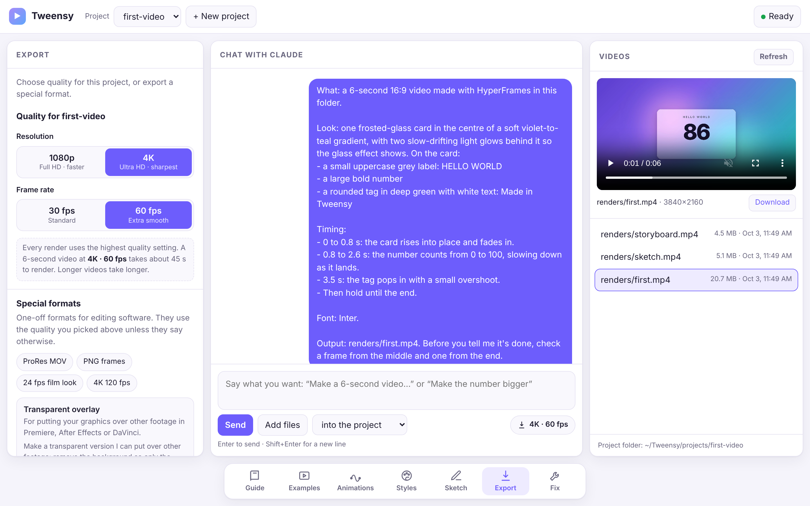</td>
    <td width="50%">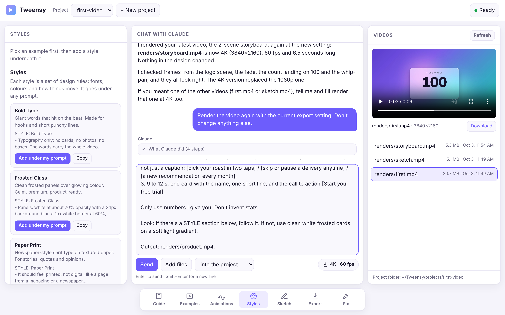</td>
  </tr>
  <tr>
    <td align="center"><b>Export.</b> 1080p or 4K, 30 or 60 fps, plus special formats.</td>
    <td align="center"><b>Styles.</b> Stack a style under any example.</td>
  </tr>
  <tr>
    <td width="50%">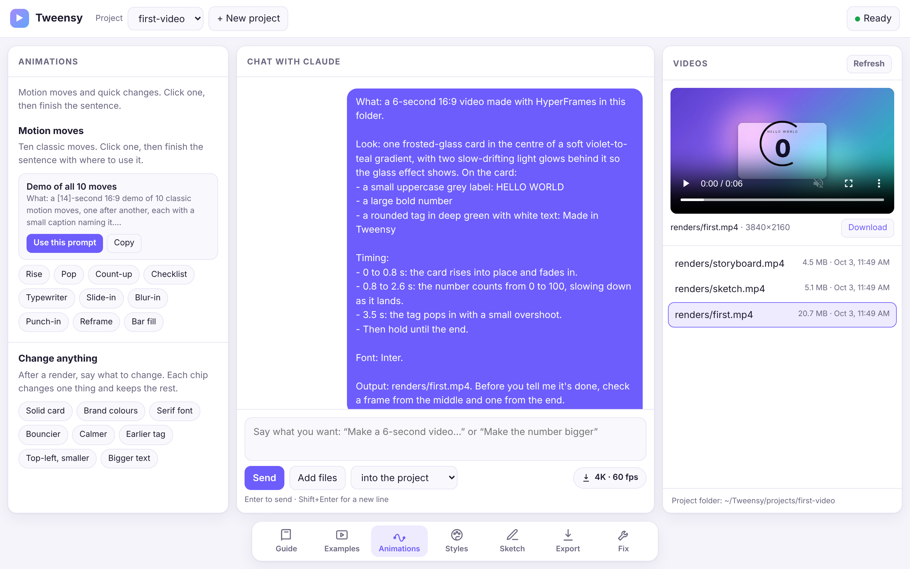</td>
    <td width="50%">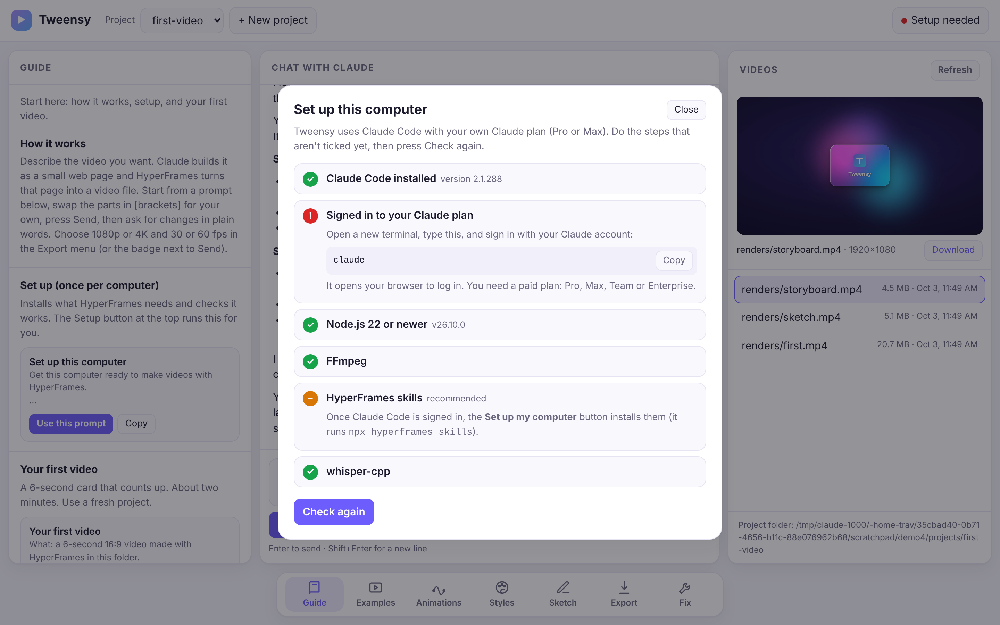</td>
  </tr>
  <tr>
    <td align="center"><b>Animations.</b> Ten moves and quick changes, one click each.</td>
    <td align="center"><b>First-run setup.</b> Finds what's missing and gives the fix.</td>
  </tr>
</table>

<p align="center">
  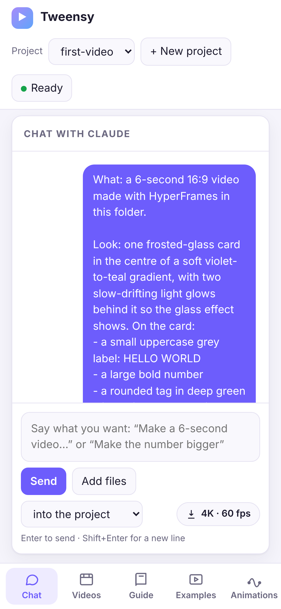
  &nbsp;
  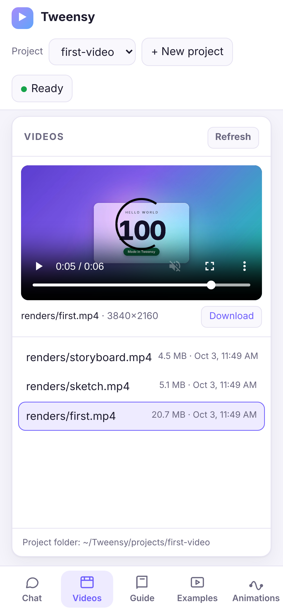
  &nbsp;
  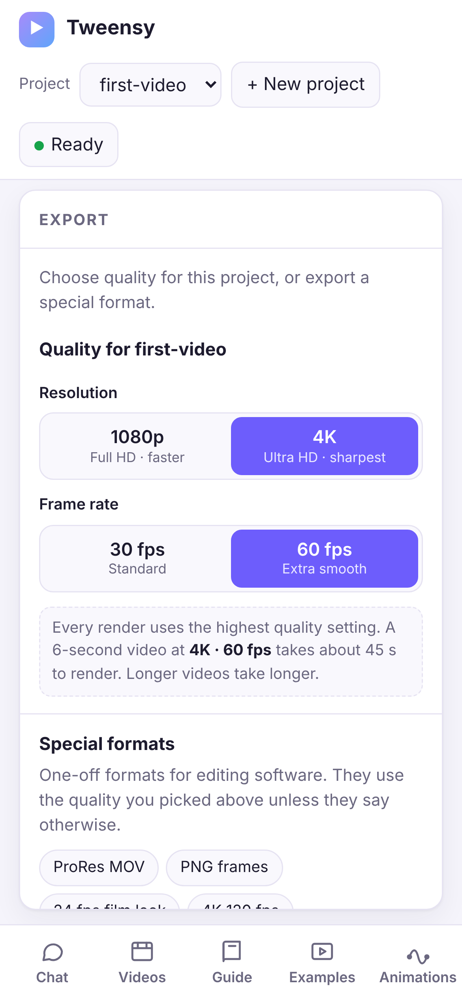<br>
  <sub>On small screens the bottom bar switches the whole view: Chat · Videos · Guide · Examples · Animations · Styles · Sketch · Export · Fix.</sub>
</p>

## How it works

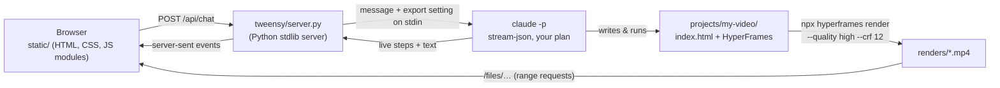

- Each project is a folder in `projects/`. Claude Code runs **inside that folder** with
  `claude -p --output-format stream-json`, resuming the project's own session each time.
- Your message goes in on **stdin**, followed by the project's export setting (for example
  `4K at 60 fps → --resolution landscape-4k --fps 60`). The tool allowlist and Claude's instructions
  come from generated files in `.runtime/`, so nothing depends on how your OS quotes arguments.
- Claude runs headless with `--permission-mode acceptEdits` and only the tools in `ALLOWED_TOOLS`
  (see [SECURITY.md](SECURITY.md)).
- Chat history and export settings are saved in `projects/.chats/`. Project folders stay empty until
  Claude scaffolds them.

## Project layout

```
tweensy/
├── app.py                        # starts the app (what the launchers run)
├── tweensy/                # the server, standard library only
│   ├── server.py                 #   HTTP routes and main()
│   ├── chat.py                   #   one chat turn: run Claude Code, stream it, save the reply
│   ├── claude.py                 #   tool allowlist, instructions, command line, step names
│   ├── export.py                 #   1080p/4K and 30/60 fps settings and the render note
│   ├── progress.py               #   reading HyperFrames' render log for the progress bar
│   ├── projects.py               #   project folders, chat history, video lists
│   ├── system.py                 #   finding Claude/Node/FFmpeg, setup checks, Stop
│   ├── config.py                 #   paths, port, OS facts
│   └── guide.py                  #   every example, style, move and fix, as data
├── static/                       # the UI, no build step
│   ├── index.html
│   ├── css/styles.css
│   └── js/                       #   ES modules: main, chat, guide, sketch, export, setup, videos, …
├── Start Tweensy.command   # macOS launcher
├── Start Tweensy.bat       # Windows launcher
├── start.sh                      # Linux launcher
├── scripts/                      # build_app.py (downloadable app) and smoke_test.py
├── tests/                        # server and helper tests (no Claude Code needed)
├── docs/                         # screenshots and demo GIF for this README
└── projects/                     # your work (git-ignored)
```

## Configuration

| What | How |
| --- | --- |
| Export quality | **Export** menu in the app (saved per project) |
| Port | `TWEENSY_PORT=9000 python3 app.py` (Windows: `set TWEENSY_PORT=9000` then `py app.py`) |
| Don't open a browser | `python3 app.py --no-browser` |
| What Claude may run | `ALLOWED_TOOLS` in `tweensy/claude.py` |
| Claude's instructions and quality bar | `SYSTEM_NOTE` in `tweensy/claude.py` |
| Render flags per setting | `render_note()` in `tweensy/export.py` |
| Add or change examples | `tweensy/guide.py` (see [CONTRIBUTING.md](CONTRIBUTING.md#changing-the-examples)) |

## Development

```sh
python3 app.py --no-browser                 # run from source
python3 -m unittest discover -s tests -v    # 23 tests, ~1 s, no Claude Code needed
pip install pyinstaller && python3 scripts/build_app.py   # build the app for this computer
```

CI runs the tests on **Ubuntu, macOS and Windows** with Python 3.9 and 3.13. Pushing a tag like
`v2.5.0` runs the **Release** workflow: it builds the app on Windows, macOS and Linux, starts each one
to check it works, and attaches `Tweensy-windows-v2.5.0.exe`, `Tweensy-mac-v2.5.0.dmg` and
`Tweensy-linux-v2.5.0.tar.gz` to the release. See [CONTRIBUTING.md](CONTRIBUTING.md).

## Troubleshooting

<details>
<summary><b>The Setup button says "Setup needed"</b></summary>

Open it. Every red item has the exact command for your computer and a **Copy** button. After
installing something, close Tweensy's terminal window, start it again, and press **Check again**.
</details>

<details>
<summary><b>"Claude Code isn't signed in"</b></summary>

Open a terminal, type `claude`, and log in with your Claude account. A paid plan is needed. Then
press **Check again**.
</details>

<details>
<summary><b>"Your Claude plan's usage limit was reached"</b></summary>

Claude Code runs on your plan's limits. A big video can use a lot of them. Your work is saved: when the
limit resets (the message says when), open the same project and say **continue**.
</details>

<details>
<summary><b>Renders take a long time</b></summary>

4K at 60 fps is about 8× the work of 1080p at 30 fps. Switch the **Export** menu to 1080p · 30 while
you try ideas, then switch back and say "render again" for the final version.
</details>

<details>
<summary><b>macOS says the starter "can't be opened"</b></summary>

Right-click `Start Tweensy.command` → **Open** → **Open**. macOS asks only the first time.
</details>

<details>
<summary><b>Windows can't find Python, Node or FFmpeg right after installing</b></summary>

Close the Tweensy window and double-click the starter again. Windows only picks up newly
installed programs in new windows.
</details>

<details>
<summary><b>A video looks wrong</b></summary>

Open the **Fix** menu for one-click fixes to the common problems. For anything else, say what you see,
like you'd tell a friend: "the text is cut off on the right", "the card covers my face".
</details>

## Credits

Inspired by *Motion Graphics with Claude Code* by [@damianodesu](https://instagram.com/damianodesu).

Rendering by [HyperFrames](https://github.com/heygen-com/hyperframes) (HeyGen). The agent is
[Claude Code](https://code.claude.com/docs) by Anthropic, running on your own plan.

## License

[MIT](LICENSE)
